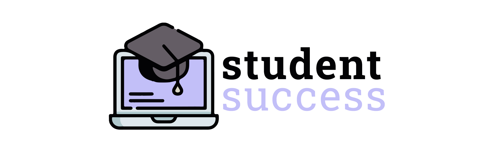

# *Student Success*
Proyecto final para el FP de Desarrollo de Aplicaciones Multiplataforma.

## Descripción general

Student Success es una aplicación de escritorio diseñada para gestionar ejercicios y mejorar la experiencia de aprendizaje de los estudiantes en programas de formación profesional a distancia.

Autor: Ángela Rodríguez Portela
Curso: Desarrollo de Aplicaciones Multiplataforma
Año Académico: 2023/2024

## Introducción

Student Success trata de una iniciativa para mejorar la calidad de aprendizaje de los alumnos que se encuentran en Formación Profesional a Distancia.

El objetivo de la aplicación es convertirse en una herramienta para recopilar recursos y ejercicios de diferentes materias, de manera que pueda ponerse en práctica las habilidades y conocimientos adquiridos durante el curso, además de la mejora de las mismas. 

### *¿Con qué propósito surge la idea?*

Student Success tiene como objetivo mejorar la calidad del aprendizaje de los estudiantes en programas de formación profesional a distancia, proporcionando una herramienta para la recopilación de recursos y ejercicios. 

## El problema

Los estudiantes se enfrentan a una serie de retos que dificultan su aprendizaje

### 1. Dificultad de la formación
La formación online, por sus características, es más exigente que la presencial.

### 2. Material insuficiente y desactualizado
El material que se utiliza en la formación es insuficiente y en la mayoría de los casos está desactualizado y es poco aclarativo.

### 3. Falta de tiempo
En la búsqueda de recursos adicionales para practicar y comprender conceptos, se
invierte una cantidad considerable de tiempo, lo cual puede generar una disminución en la motivación e interés.

## La solución

Estas necesidades dan lugar a la idea de
Student Success. Una aplicación de escritorio donde los alumnos puedan encontrar ejercicios y practicar sus habilidades sacando el máximo partido a su tiempo de estudio.

- **Entrenamiento en un solo lugar**. Posee un sistema de almacenamiento de ejercicios escalable con distintos niveles de dificultad y de todas las asignaturas.

- **Evaluación y crecimiento**. Un espacio donde mejorar habilidades y conseguir calificaciones por parte de los profesores.

## Tecnologías utilizadas para el desarrollo

- JAVA + SWING
- HIBERNATE
- PATRÓN MVC
- PATRÓN DAO
- LIBRERIA LOMBOK
- LIBRERIA BCRYPT
- LIBRERÍA JCALENDAR
- JAVADOC
- SISTEMA DE AYUDA JAVAHELP
- GENERACIÓN DE INFORMES CON IREPORT

## Demostración
Para tener acceso al repositorio privado y visualizar el código, es necesario contactar.
